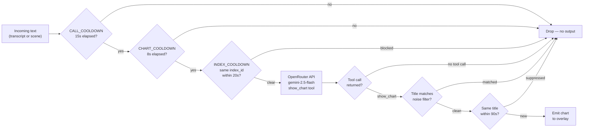

# DataLens

A real-time data visualization desktop app that watches your screen and audio, detects concrete data points in what you're seeing and hearing, and renders live chart overlays — without you doing anything.

## How it works


VideoDB handles the heavy lifting — it transcribes audio and runs visual scene analysis on your screen. The results arrive as structured WebSocket events. VizAgent receives those text descriptions and uses OpenRouter (Gemini Flash) with function calling to decide whether the content contains chartable data. When it does, a chart appears in a persistent sidebar overlay on top of all your windows.

### VizAgent decision flow



## Prerequisites

- Node.js 18+
- pnpm
- A [VideoDB](https://videodb.io) account with an API key and collection ID
- An [OpenRouter](https://openrouter.ai) API key
- A DataLens frontend deployment (see [packages/frontend](packages/frontend/)) for auth

## Setup

```bash
pnpm install
```

Navigate to the desktop package:

```bash
cd packages/desktop
```

## Running in development

```bash
pnpm dev
```

This opens two windows:
- **Control window** (420×640) — sign in, list capture devices, start/stop sessions, view logs
- **Overlay window** — transparent, full-screen, always on top, mouse passthrough (except when hovering the sidebar)

## Auth

DataLens uses a browser-based OAuth flow. On first launch, click **Sign in with DataLens** in the control window. This opens your browser to the DataLens frontend, which authenticates via Clerk and redirects back to a local callback server on a random port. The desktop app receives your API keys and stores them locally in an encrypted electron-store file.

No credentials are stored in plaintext. The local store uses AES-256 encryption via `electron-store`.

## Starting a capture session

1. Click **List Capture Devices** to enumerate available displays and audio sources
2. Optionally pick a specific display or audio device from the dropdowns (defaults to auto-select)
3. Click **Start Capture**

The capture sequence:
1. A VideoDB capture session is created and a WebSocket is connected
2. The native capture binary starts recording screen + system audio
3. After a 4-second delay (for server registration), transcript and visual index streams are activated
4. WebSocket events start flowing — charts appear within seconds of chartable data being detected

## Stopping

Click **Stop** in the control window. This gracefully stops the capture binary, closes the WebSocket, and clears the chart context.

## The overlay sidebar

The sidebar is 280px wide, pinned to the right edge of your screen, and always visible above other windows. It never auto-dismisses charts — everything accumulates. Charts update in place when the same metric appears again with new data.

### Supported chart types

| Type | Best for |
|---|---|
| `metric_card` | Single KPI with delta arrow |
| `bar` | Vertical bars by category |
| `bar_horizontal` | Ranked horizontal bars |
| `line` | Single trend over time |
| `line_multi` | Multiple trend lines |
| `area` | Cumulative area trend |
| `donut` | Part-of-whole proportions |
| `progress_bar` | Actual vs goal |
| `waterfall` | Bridge decomposition (positive/negative deltas) |
| `bullet` | Actual vs target per row |
| `scatter` | Correlation |
| `heatmap` | Grid intensity |
| `sparkline` | Minimal directional trend, no axes |
| `text_callout` | Pull quote |
| `comparison_table` | Before/after table |

### Deduplication

- Same chart title is suppressed for 90 seconds (`METRIC_TTL_MS`)
- Minimum 8 seconds between any two overlays (`CHART_COOLDOWN_MS`)
- Minimum 15 seconds between OpenRouter API calls (`CALL_COOLDOWN_MS`)
- Same visual scene (by `index_id`) can only trigger one chart per 20 seconds (`INDEX_COOLDOWN_MS`)

### Consolidation

Every 60 seconds, a consolidator pass runs. It sends all accumulated charts to the model and asks whether any can be merged into a richer combined view (e.g. two quarterly metrics → a line chart). If the model produces an upgrade, it replaces the originals in the sidebar.

### What DataLens will not chart

- Vague or qualitative statements without concrete numbers
- Social media engagement metrics (subscribers, likes, views, shares)
- UI element counts or interface statistics visible in screen captures

## Agents

### VizAgent

Receives transcript text and visual scene descriptions. Calls OpenRouter with the `show_chart` function schema. The model calls `show_chart` only when it finds concrete, chartable data — specific numbers, percentages, comparisons, distributions, trends, or goals. If nothing chartable exists, the model returns no tool call and nothing is shown.

### SummaryAgent

Buffers `audio_index` events (VideoDB's higher-level scene summaries) over a 5-minute rolling window. Extracts key points, the current topic, and numeric data mentions. Emits a summary update every 60 seconds.

### AlertAgent

Keyword-based alerting. User-defined alerts (keyword + description) are matched against incoming event text. When a keyword fires, an OS notification is shown via Electron's `Notification` API. Each alert is rate-limited to once per 60-second window per keyword match.

## Project structure

```
packages/
  desktop/
    src/
      main/
        index.ts              — Electron main process, window management
        ipc/
          auth.ts             — IPC handlers for sign-in / sign-out
          capture.ts          — IPC handlers for start/stop/list-devices
          overlay.ts          — IPC handler for overlay window
        services/
          auth.ts             — OAuth browser flow + local callback server
          config.ts           — Encrypted electron-store read/write
          videodb.ts          — VideoDB SDK: session, WebSocket, RTStreams
          bus.ts              — AgentBus: routes WebSocket events to agents
          viz-agent.ts        — VizAgent: OpenRouter function calling → charts
          summary-agent.ts    — SummaryAgent: rolling summary from audio_index
          alert-agent.ts      — AlertAgent: keyword matching → OS notifications
      preload/
        index.ts              — Context bridge (recorderAPI, configAPI, authAPI)
      renderer/
        ControlApp.tsx        — Control window UI
        OverlayApp.tsx        — Overlay sidebar with all 15 chart renderers
      types/
        index.ts              — Shared TypeScript interfaces (UVS, VideoDBEvent, …)
  frontend/                   — Next.js app (auth, settings, API keys delivery)
  shared/                     — Shared types across packages
```

## Building for production

```bash
cd packages/desktop
pnpm package
```

Output goes to `packages/desktop/release/`. Produces an NSIS installer on Windows and a DMG on macOS.

## Environment

The desktop app reads one optional environment variable:

| Variable | Default | Purpose |
|---|---|---|
| `DATALENS_FRONTEND_URL` | `https://datalens-eosin.vercel.app` | Auth + config endpoint |

All other secrets (VideoDB API key, OpenRouter API key, collection ID) are fetched from the frontend at sign-in time and stored locally.

## Tech stack

- **Electron** + **electron-vite** — app framework and build tooling
- **React 18** — control and overlay windows
- **Recharts** — all chart rendering
- **VideoDB SDK** — capture session management, WebSocket events, RTStream transcription and visual indexing
- **OpenRouter** — model routing (primary: `google/gemini-2.5-flash`)
- **electron-store** — encrypted local config persistence
- **Clerk** (via frontend) — user authentication
