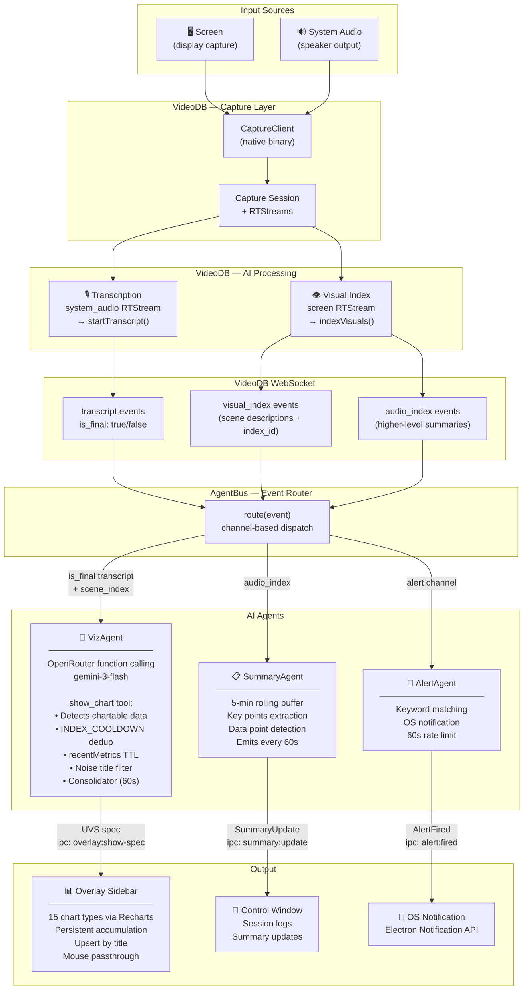
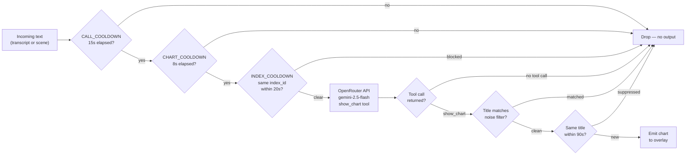

# DataLens

A real-time data visualization desktop app that watches your screen and audio, detects concrete data points in what you're seeing and hearing, and renders live chart overlays — without you doing anything.

## How it works



VideoDB handles the heavy lifting — it transcribes audio and runs visual scene analysis on your screen. The results arrive as structured WebSocket events. VizAgent receives those text descriptions and uses OpenRouter (Gemini Flash) with function calling to decide whether the content contains chartable data. When it does, a chart appears in a persistent sidebar overlay on top of all your windows.

### VizAgent decision flow



## For end users — getting started

No API keys required. Everything is delivered after you sign in.

### 1. Install

Download the latest release from the [Releases](../../releases) page and run the installer: `DataLens-Setup-x.x.x.exe`.

Or build from source:

```bash
git clone https://github.com/FelixMatrixar/datalens
cd datalens
pnpm install
cd packages/desktop
pnpm package
# installer appears in packages/desktop/release/
```

### 2. Sign in

Launch DataLens. Click **Sign in** in the floating control pill at the bottom of your screen. Your browser will open the DataLens sign-in page. After signing in with Clerk, the browser tab will close itself and the app is ready — no copy-pasting any keys.

Your credentials are fetched from the server and stored locally in an AES-256 encrypted file. They persist across restarts.

### 3. Start a capture

Click **▶ Start** in the pill. A device picker slides up — optionally choose a specific display or audio source (defaults to auto). Click **▶ Start Capture**. Charts begin appearing within seconds of any chartable data being spoken or shown on screen.

Click **⏹ Stop** when done.

---

## For developers — running locally

Prerequisites: Node.js 18+, pnpm.

```bash
pnpm install
cd packages/desktop
pnpm dev
```

This opens two Electron windows:
- **Control pill** — floating bottom-left, frameless, draggable. Sign in, pick devices, start/stop.
- **Overlay window** — transparent, full-screen, always on top. Mouse passes through except when hovering the viz or telemetry panels.

To use without signing in (bring your own keys), click **⚙** in the pill and choose **Configure manually**. Enter your OpenRouter or Google AI key plus your VideoDB API key and collection ID.

---

## For deployers — sharing with your team

This is how you publish DataLens so your team can use it with **your** API keys via sign-in — nobody needs to paste anything.

### 1. Deploy the frontend to Vercel

```bash
cd packages/frontend
vercel deploy
```

### 2. Set environment variables in Vercel

Go to your Vercel project → **Settings → Environment Variables** and add:

| Variable | Required | Description |
|---|---|---|
| `VIDEODB_API_KEY` | ✓ | From [videodb.io](https://videodb.io) dashboard |
| `VIDEODB_COLLECTION_ID` | ✓ | The collection to store sessions in |
| `OPENROUTER_API_KEY` | one of these | From [openrouter.ai](https://openrouter.ai) |
| `GOOGLE_AI_API_KEY` | one of these | From [aistudio.google.com](https://aistudio.google.com) |
| `CLERK_SECRET_KEY` | ✓ | From your Clerk dashboard |
| `NEXT_PUBLIC_CLERK_PUBLISHABLE_KEY` | ✓ | From your Clerk dashboard |

If you provide both AI keys, OpenRouter is used by default. The `/api/config` endpoint delivers the appropriate keys after authentication — nothing is in the repository.

### 3. Control who can sign in

In your [Clerk dashboard](https://dashboard.clerk.com):
- Disable public sign-up and invite specific users by email, **or**
- Restrict sign-up to your organisation's email domain

Anyone with Clerk access will use your API keys, so only invite people you trust.

### 4. Redeploy and share

Push the repo URL. Users clone, run `pnpm install && cd packages/desktop && pnpm package`, and click **Sign in**. That's it.

---

## Starting a capture session

1. Click **▶ Start** in the pill — a device picker slides up
2. Optionally pick a specific display or audio device (defaults to auto-select)
3. Click **▶ Start Capture**

The capture sequence:
1. A VideoDB capture session is created and a WebSocket is connected
2. The native capture binary starts recording screen + system audio
3. After a 4-second delay (for server registration), transcript and visual index streams are activated
4. WebSocket events start flowing — charts appear within seconds of chartable data being detected

## Stopping

Click **⏹ Stop** in the pill. This gracefully stops the capture binary, closes the WebSocket, and clears the chart context.

## The overlay

Two floating panels appear on the right side of your screen, always above other windows. Mouse clicks pass through them unless you're hovering one of the panels.

### Viz panel (top-right)

Shows live charts as they're detected. Draggable and lockable — grab the handle to reposition, click the lock icon to pin it back to its default position. Minimises to a single strip showing only the most recent chart title.

Charts never auto-dismiss. Everything accumulates. When the same metric appears again with new data, the chart updates in place.

### Supported chart types

| Type | Best for |
|---|---|
| `metric_card` | Single KPI with delta arrow |
| `bar` | Vertical bars by category |
| `bar_horizontal` | Ranked horizontal bars |
| `line` | Single trend over time |
| `line_multi` | Multiple trend lines |
| `area` | Cumulative area trend |
| `donut` | Part-of-whole proportions |
| `progress_bar` | Actual vs goal |
| `waterfall` | Bridge decomposition (positive/negative deltas) |
| `bullet` | Actual vs target per row |
| `scatter` | Correlation |
| `heatmap` | Grid intensity |
| `sparkline` | Minimal directional trend, no axes |
| `text_callout` | Pull quote |
| `comparison_table` | Before/after table |

### Telemetry panel (bottom-right)

A live log of every decision VizAgent makes: API calls, charts shown, noise filtered, rate limits hit, cooldowns active. Each entry has an icon and timestamp. Draggable, lockable, and minimisable to a single button.

### Deduplication

- Same chart title is suppressed for 90 seconds (`METRIC_TTL_MS`)
- Minimum 8 seconds between any two overlays (`CHART_COOLDOWN_MS`)
- Minimum 15 seconds between AI API calls (`CALL_COOLDOWN_MS`)
- Same visual scene (by `index_id`) can only trigger one chart per 20 seconds (`INDEX_COOLDOWN_MS`)

### Consolidation

Every 60 seconds, a consolidator pass runs. It sends all accumulated charts to the model and asks whether any can be merged into a richer combined view (e.g. two quarterly metrics → a line chart). If the model produces an upgrade, it replaces the originals in the sidebar.

### What DataLens will not chart

- Vague or qualitative statements without concrete numbers
- Social media engagement metrics (subscribers, likes, views, shares)
- UI element counts or interface statistics visible in screen captures

## Agents

### VizAgent

Receives transcript text and visual scene descriptions. Calls either **OpenRouter** or **Google AI** (based on your configured provider) with the `show_chart` function schema. The model calls `show_chart` only when it finds concrete, chartable data — specific numbers, percentages, comparisons, distributions, trends, or goals. If nothing chartable exists, the model returns no tool call and nothing is shown.

**Google AI fallback chain:** `gemini-3-flash-preview` → `gemini-2.5-flash` → `gemini-2.5-flash-lite`. Rate limits (HTTP 429) skip to the next model and are logged in the telemetry panel. If all models are exhausted the event is dropped silently.

### SummaryAgent

Buffers `audio_index` events (VideoDB's higher-level scene summaries) over a 5-minute rolling window. Extracts key points, the current topic, and numeric data mentions. Emits a summary update every 60 seconds.

### AlertAgent

Keyword-based alerting. User-defined alerts (keyword + description) are matched against incoming event text. When a keyword fires, an OS notification is shown via Electron's `Notification` API. Each alert is rate-limited to once per 60-second window per keyword match.

## Project structure

```
packages/
  desktop/
    src/
      main/
        index.ts              — Electron main process, window management
        ipc/
          auth.ts             — IPC handlers for sign-in / sign-out
          capture.ts          — IPC handlers for start/stop/list-devices
          overlay.ts          — IPC handler for overlay window
        services/
          auth.ts             — OAuth browser flow + local callback server
          config.ts           — Encrypted electron-store read/write
          videodb.ts          — VideoDB SDK: session, WebSocket, RTStreams
          bus.ts              — AgentBus: routes WebSocket events to agents
          viz-agent.ts        — VizAgent: OpenRouter or Google AI function calling → charts
          summary-agent.ts    — SummaryAgent: rolling summary from audio_index
          alert-agent.ts      — AlertAgent: keyword matching → OS notifications
      preload/
        index.ts              — Context bridge (recorderAPI, configAPI, authAPI)
      renderer/
        ControlApp.tsx        — Control window UI
        OverlayApp.tsx        — Overlay sidebar with all 15 chart renderers
      types/
        index.ts              — Shared TypeScript interfaces (UVS, VideoDBEvent, …)
  frontend/                   — Next.js app (auth, settings, API keys delivery)
  shared/                     — Shared types across packages
```

## Building for production

```bash
cd packages/desktop
pnpm package
```

Output goes to `packages/desktop/release/`. Produces an NSIS installer (`.exe`).

## Environment

The desktop app reads one optional environment variable at build time:

| Variable | Default | Purpose |
|---|---|---|
| `DATALENS_FRONTEND_URL` | `https://datalens-eosin.vercel.app` | Auth + config endpoint |

All secrets (VideoDB key, collection ID, AI API key) are fetched from the Vercel backend at sign-in and stored locally in an AES-256 encrypted file via `electron-store`. Nothing is in the binary.

## Tech stack

- **Electron** + **electron-vite** — app framework and build tooling
- **React 18** — control pill and overlay windows
- **Recharts** — all 15 chart renderers
- **VideoDB SDK** — capture session management, WebSocket events, RTStream transcription and visual indexing
- **OpenRouter** — AI provider option (primary model: `google/gemini-3-flash-preview`)
- **Google AI REST API** — AI provider option, fallback chain: `gemini-3-flash-preview` → `gemini-2.5-flash` → `gemini-2.5-flash-lite`
- **electron-store** — AES-256 encrypted local config
- **Clerk** (via Vercel frontend) — user authentication and key delivery
